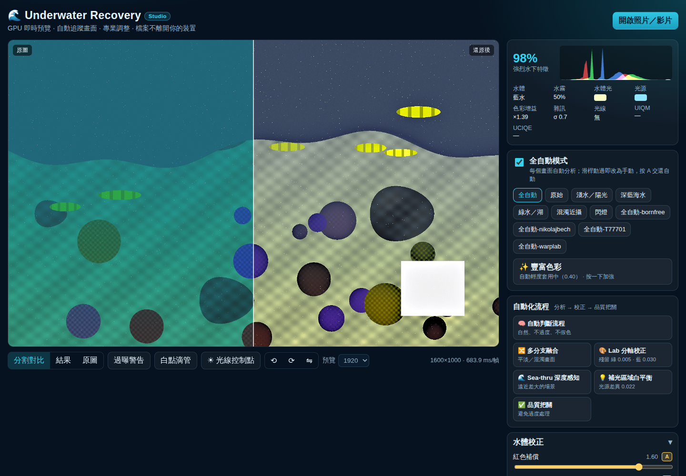
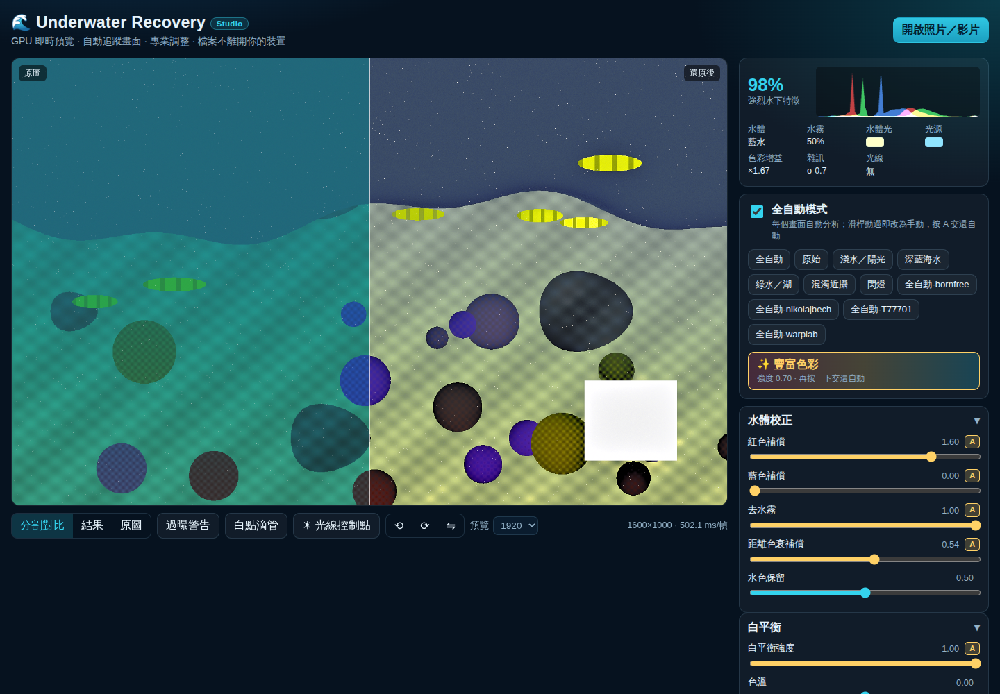
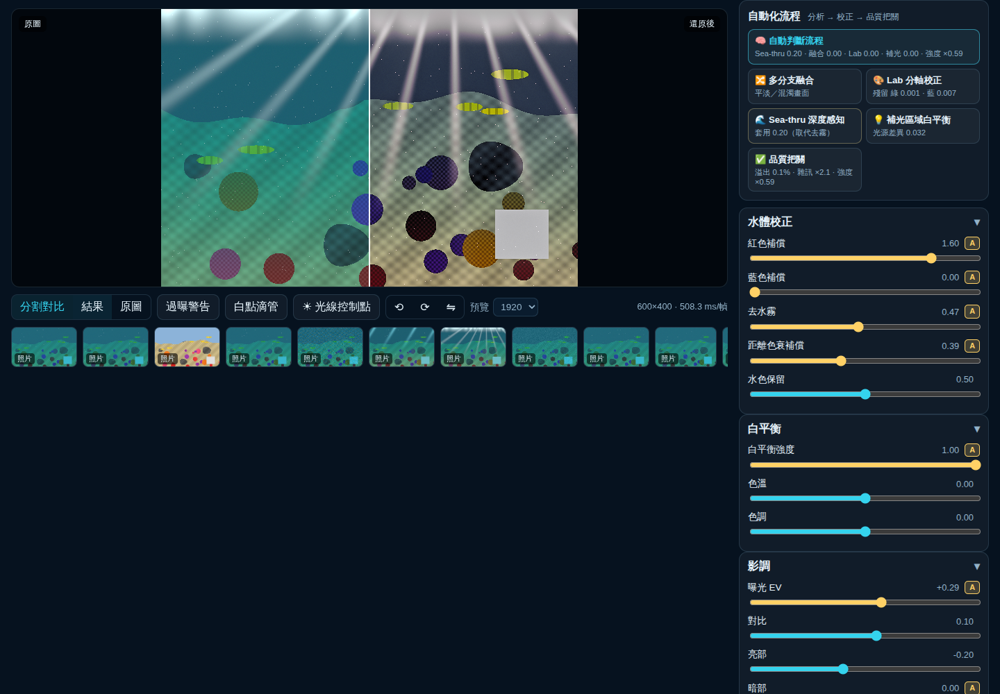
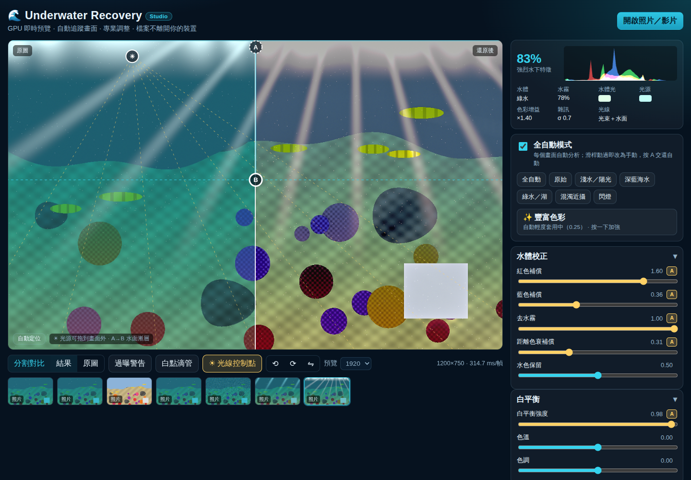
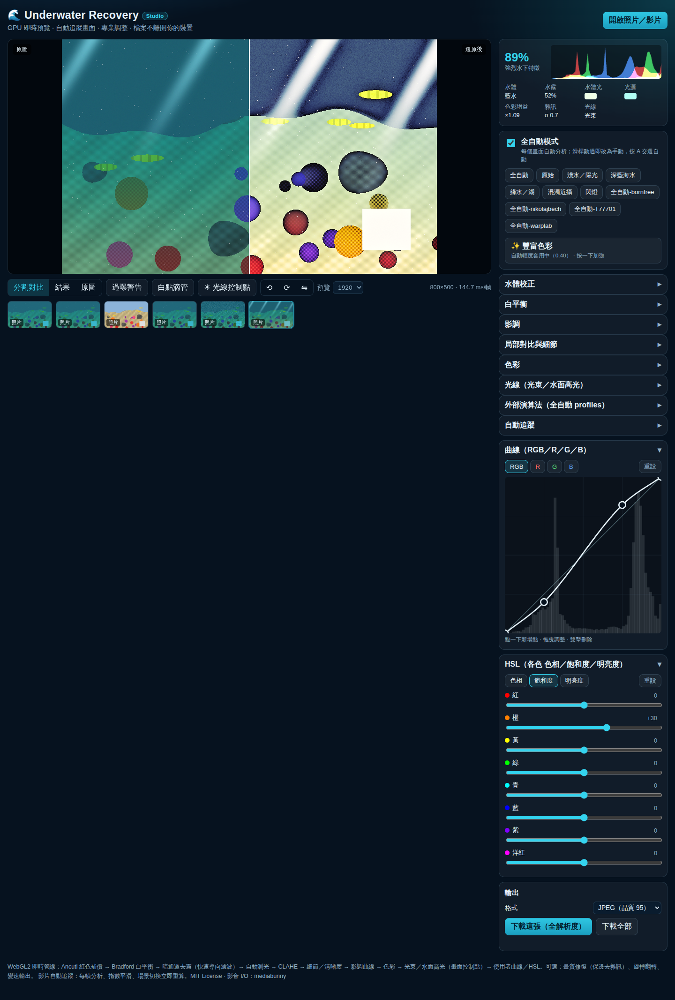

# 🌊 Underwater Recovery Studio

Real-time, high-quality recovery of underwater **photos and video**, entirely in
your browser. Every slider change and every video frame is re-graded live on
the GPU; an auto engine analyses each frame and **tracks the scene as the camera
moves** — descending, panning, cutting from blue to green water — while every
stage stays under professional manual control.

**No server, no upload, no account.** Pixels never leave the tab.



## Quick start

```bash
npm install
npm run dev        # http://localhost:5173
npm test           # typecheck + unit tests (Node, no browser)
npm run verify     # build + end-to-end verification in headless Chromium
                   # (CHROME_PATH=/path/to/chrome to use an installed browser)
node --experimental-strip-types scripts/optimize.ts [--report] [--real]   # re-tune auto against the scene suite
npm run build      # typecheck + production bundle
```

## Comparing with other apps (Diverout)

[`docs/diverout-review.md`](docs/diverout-review.md) reviews a proposed
reverse-engineering plan for the Diverout app, runs its six black-box probes
(colour chart under water, depth ramp, grey wedge / land photo, impulse,
dropped video frame, flips) on this engine, and lists what to improve. The
probe kit in [`docs/probe-kit/`](docs/probe-kit) runs any other app on the same
files; `npm run probe-kit -- compare docs/probe-kit <its outputs>` scores both
with the same metrics, and `npm run probes` scores this engine alone.

## Android and macOS apps

The same Studio as installable apps — **Android** (`.apk`, Capacitor) and
**macOS** (`.dmg`, Electron; Apple silicon and Intel) — built by GitHub
Actions and published on
[Releases → `app-latest`](https://github.com/jonwenjen/Underwater-recovery/releases/tag/app-latest).
Install notes (unknown-source install on Android, first launch of a
non-notarised Mac app) and how they are built: [`apps/README.md`](apps/README.md).

## What it does

| Problem | Stage | How |
|---|---|---|
| Missing reds | **Red compensation** | Ancuti et al. (2018): `R += α·(Ḡ−R̄)·(1−R)·G` — rebuilds red from green where the scene has signal; blue compensation for green water |
| Blue / green cast | **White balance** | Grey-world illuminant → one **Bradford (von Kries) 3×3 matrix**; temperature / tint on top; **eyedropper** makes any tapped surface exactly neutral |
| Water haze | **Dehaze** | Water light = the *dominant smooth hazy colour* (Red Channel Prior + texture); transmission from **haze-lines** (Berman et al.); refined by a **guided filter** and upsampled edge-aware on the GPU; acts on luminance, keeps balanced chroma; open water is re-tinted to *clear* water instead of clipped |
| Distance colour loss | **Distance compensation** | Red lifted in proportion to `(1−t)` — farther objects lost more |
| Low contrast | **Exposure → CLAHE → clarity** | Log-average auto exposure with a dead zone; CLAHE on luminance only, scaled down when dehaze already restored contrast |
| Soft detail / particles | **Sharpen + denoise** | Threshold-gated: edges above the threshold are sharpened, flat water below it is smoothed (backscatter) |
| Tone & colour | **Curve + vibrance** | Levels (auto 0.3 / 99.7 % percentiles), shadows / highlights, contrast, vibrance, saturation, mid-tone de-cast (with a guard that stops it turning open water violet on a sandy bottom), 8-bit dither |
| Sunlight | **光束 / 水面高光** | Beams detected from streak geometry and enhanced or suppressed toward a draggable light source; the surface band's clipped highlights recovered with a draggable A→B gradient; pale sunlight kept white instead of pink |
| Grain | **Auto 畫質修復** | Luminance grain σ measured per frame (Immerkær, flattest blocks); restoration, denoise and the sharpen threshold follow it |

### Auto mode that follows the video

- Each frame is read back at 192 px; a CPU **mirror** of the shader pipeline
  derives every parameter stage by stage (≈ 3 ms on a laptop).
- Global values (illuminant, water light, exposure, compensation…) are
  smoothed with an exponential moving average — the **反應時間** slider sets its
  time constant — so the grade glides as you descend instead of flickering.
- **Scene cuts** (soft colour-histogram distance) snap the tracker instantly;
  camera pans do not.
- Spatial maps (transmission, CLAHE tiles) are recomputed every frame so they
  move with the picture.

### ✨ 豐富色彩 (rich colour)

Accurate recovery can look flat. Full auto now applies a mild dose (0.4,
found by the optimizer); one tap on **✨ 豐富色彩** locks a strong one (0.7,
strength in the 色彩 group), a second tap hands it back to auto. Every
amount is *measured per frame*:

- **Adaptive chroma** — mean OKLab chroma of surfaces is measured and a gain
  computed toward a vivid target: flat frames get a lot, colourful ones little.
  Hue-preserving (OKLab), near-neutrals (greys, whites) left alone, soft
  roll-off, and a **gamut fit** that gives back only the added chroma instead
  of clipping.
- **Warm emphasis** on reds / oranges — the colours water removes first.
- **More light** — the auto-exposure target and contrast rise, and open
  water keeps a deeper blue. (De-cast is deliberately *not* eased: the cast
  it would leave is blue-cyan, opposite to warm surfaces, and cost chroma.)



### 🧠 自動化流程: the adaptive underwater pipeline



Six one-tap automations after the "analyse → correct → check quality" approach
of the underwater-enhancement literature. No neural network runs in the
browser: each is the algorithmic idea (WaterNet / Ancuti fusion, UIEC²-Net's
separate colour axes, Sea-thru, local white balance, UIQM / UCIQE quality
control), analysed on the frame and applied on the GPU, with a CPU twin so it
is measured like everything else. A module button locks a measured-good
strength; pressing it again hands it back to auto.

| Button | What it does | Measured against full auto |
|---|---|---|
| 🧠 自動判斷流程 | **Natural mode.** Analyses the frame and switches modules on by need; turns 品質把關 on. On real photographs only Sea-thru helped, so that is what it engages (the other rule gains searched to 0 on half the photos) | real photos, hold-out half: ΔE **0.122 → 0.084**, local contrast 1.50× → 1.14×; sunlit scene colour error 0.163 → 0.140. Heavily degraded ground-truth scenes get less restoration (suite 0.794 → 0.947) |
| 🔀 多分支融合 | White-balanced, gamma (0.7) and histogram-equalised (CLAHE) branches of the luminance, blended per pixel by local contrast × well-exposedness; weights smoothed (the coarse levels of a fusion pyramid), so no halos | green water −0.098, murky −0.091, clean photo −0.041; blue water and strobe worse; GPU green water colour error 0.175 → 0.169 |
| 🎨 Lab 分軸校正 | Residual green / blue cast of pale surfaces removed along OKLab a (green↔red) and b (blue↔yellow), only toward red / yellow; saturated colours and open water protected | sunlit −0.059; blue scenes +0.03…+0.08 — full auto already neutralises the cast there, so this is for footage where some remains |
| 🌊 Sea-thru 深度感知 | Backscatter fitted per channel from the darkest pixels at each pseudo-depth, attenuation from how the rest falls with depth; depth from the transmission map; takes over from dehaze instead of stacking on it | strobe colour error 0.188 → **0.140** (GPU), sunlit 0.185 → 0.145; real photos ΔE 0.136 → 0.114 |
| 💡 補光區域白平衡 | A strobe or torch lights near subjects white while the rest stays in water light: the light is read from near-neutral surfaces on a 4 × 4 grid and the difference corrected | green water colour error 0.175 → **0.164** (GPU), shallow blue −0.02…−0.04; far part of the strobe scene 0.224 → 0.169 |
| ✅ 品質把關 | UIQM and UCIQE, plus over-processing checks against the source: newly blown highlights, grain amplification in flat areas, local-contrast overshoot. For a still, the strongest enhancement that stays within the limits is found by bisection (dehaze, CLAHE, fusion, 豐富色彩, sharpening, exposure lift and the white point scale together); video eases toward it | real photos ΔE 0.136 → **0.089**; strobe newly blown 0.3 % → 0.0 % and colour error 0.188 → 0.152 (GPU) |

Limits were calibrated on what true restoration needs on the ground-truth
scenes (local contrast legitimately rises 1.3–3.8×, grain 1.0–1.9×) and
clipping is held tightest: full auto clipped 5–38 % of the pixels of real
frames against 0–24 % in their references. UIQM / UCIQE show in the analysis
card whenever quality is measured.

**Why two targets.** Heavily degraded ground-truth scenes reward full
restoration (full auto); mild real footage rewards natural, gentle processing
(自動判斷流程). The table shows both honestly; neither mode wins everywhere.

**Does stacking modules on full auto help?** Every one of the 32 on/off
combinations of the five modules was scored on full auto
(`node --experimental-strip-types scripts/optimize.ts --combos`, strengths as
the buttons lock them). On average, barely: the best stack, 融合 + 補光, improves
the ground-truth suite by 1.6 % (0.794 → 0.781); most stacks are worse, and
adding Sea-thru or 品質把關 costs the heavily degraded scenes 11–40 %. The gains
are per scene, from one or two modules:

| Scene | Best stack on full auto | Δ total |
|---|---|---|
| Strobe close-up | 融合 + Sea-thru | **−0.314** |
| Green water | 融合 + 補光 | −0.149 |
| Murky | 融合 | −0.091 |
| Sunlit shallows | 融合 + Lab | −0.083 |
| Clean / blue 4–8 m | 補光 or 融合 + 補光 | −0.02…−0.04 |
| Blue 12 m | none (full auto alone) | 0 |

On the real EUVP photographs the picture flips: anything with 品質把關 lands at
ΔE 0.089–0.093 against 0.136 for full auto, Sea-thru alone at 0.114, the rest
at 0.134–0.140. So: don't press everything — pick the one or two modules the
scene calls for (or let 自動判斷流程 pick for mild real footage).

### 🤖 AI 風格 (FUnIE-GAN, optional)

The one neural network, and only on request. FUnIE-GAN (Islam, Xia & Sattar,
RA-L 2020, MIT licence — `public/models/FUnIE-GAN-LICENSE`) is a 7 M-parameter
U-Net GAN trained on EUVP. Its PyTorch weights were exported to ONNX and
converted to float16 (14 MB; BatchNorm / Resize / Pad kept in float32, which
keeps it within 1.4 of 255 levels of the float32 model).

- **Nothing loads until the button is pressed.** Then the ONNX Runtime Web
  build this device can use (WebGPU on a real adapter with `shader-f16`,
  otherwise single-threaded WASM, 3.7 MB gzipped) and the model are fetched
  once. They are plain files under `ort/<version>/`, downloaded with
  `fetch()` (retried, with progress) like the model; the runtime is imported
  from a Blob URL and the `.wasm` handed over as bytes — some phones refuse a
  module import of the file URL every time while `fetch()` works. The main
  bundle grows by 2 KB.
- **The network runs small, the picture stays full resolution.** It sees a
  copy with a long edge of 256 px (WASM) or 512 px (WebGPU); what it did is
  fitted as an 8-tile grid of 3 × 4 colour transforms (weighted least squares,
  regularised toward the whole-frame fit) that the GRADE pass interpolates and
  applies to the full-resolution source — so detail is the camera's and the
  colour and tone are the network's. Grid vs network: ΔE 0.02 on EUVP.
- **Video:** the network re-runs every 0.5 s of footage (snapping on cuts,
  otherwise blending), in the preview and in video export.
- **It replaces the engine's colour and tone, it does not stack on them.**
  Measured with the grid on the CPU mirror (OKLab ΔE, lower is better):

| | EUVP real pairs (×23) | Ground-truth scenes (×7) |
|---|---|---|
| FUnIE-GAN itself (full network output) | 0.058 | 0.209 |
| **🤖 AI 風格 button** (network colour/tone, engine detail stages) | **0.057** | 0.208 |
| AI stacked on full auto | 0.136 | 0.172 |
| AI stacked on 自動判斷流程 | 0.088 | 0.191 |
| 全自動 (no AI) | 0.141 | **0.138** |
| 自動判斷流程 (no AI) | 0.091 | 0.170 |

  Stacking double-corrects (the network already removed the cast the engine
  then removes again), so the button turns the engine's colour, dehaze,
  CLAHE, tone and 豐富色彩 stages off and keeps sharpening, noise reduction and
  畫質修復; 🤖 AI 風格強度 blends it. On EUVP-like footage (the network's own
  domain) it is the best option measured; on heavily degraded water it is a
  look, not a restoration — full auto restores truer colour there.
- **Cost:** first press downloads ~18 MB (model + WASM runtime; WebGPU runtime
  6.7 MB instead of 3.7 MB). In the software-GPU test browser a 256 px
  inference takes 0.4–0.7 s on WASM (the grid then renders at full frame rate);
  the test browser has no WebGPU, so that path's speed is not measured here.
  Not included: U-Shape Transformer (31.6 M parameters, 63 MB even in float16,
  fixed 256 × 256 input, 361 ms per frame on a server CPU, 2–3× FUnIE-GAN),
  UIEDP and AquaDiff (diffusion: many network passes per image, a server GPU in
  practice, which would break "files never leave your device").

### ☀ Light: beams and surface highlights, with on-image control points



Press **☀ 光線控制點** in the toolbar to show the control points on the picture:

- **☀ light source** — the point the sun beams converge on. Auto finds it from
  the streaks themselves (local structure tensor: long, coherent, bright,
  near-vertical ridges; their lines are intersected, parallel beams put the
  source far above the frame). Drag it anywhere — also **outside the frame**
  (drag past the edge; it is then drawn dashed at the edge). **☀ 光束強度**
  `+` adds light along the beams (a radial blur of the bright part of the
  frame toward the source), `−` takes the beam structure away; **光束長度**
  and **光束色溫** shape it.
- **A → B surface gradient** — full effect at A (the surface), none past B.
  Auto places B where the bright top band fades back to the scene.
  **水面高光壓制** compresses highlights above a knee (clipped surface comes
  back), **水面亮度 / 水面色溫** set tone and warmth inside the gradient.
- Dragging a point makes that group manual (and turns its effect on if it was
  off); **double-click** a point or press **自動定位** to hand it back to auto.
  Arrow keys nudge a focused point (Shift = ×10).
- **光線去洋紅** — red compensation adds red where green is bright, so pale
  sunlight can come out pink. Where light is detected, bright *pale* magenta
  is pulled back to white; saturated pinks (coral, fish) are untouched.

On video, the source and gradient track the scene like every other auto value
(beam detection runs every third frame).

### How auto was tuned

`scripts/optimize.ts` scores the CPU mirror of the pipeline on a suite of
ground-truth scenes — the verify reef (two layouts) degraded with the
Jaffe–McGlamery model: blue water at 4 / 8 / 12 m, green water 6 m, murky
water with grain, a strobe close-up at 10 m, sunlit shallows (2.5 m) with
beams and a clipped surface, and a clean non-underwater photo that must stay
untouched. The score is the mean OKLab ΔE to the true colours on surfaces
(hue, chroma and lightness at once), chromaticity error (the colour itself,
whatever the exposure), local-contrast match, white-slate neutrality,
clipping, open-water hue (no violet) and harm to the clean photo.
Coordinate descent over every constant that maps a measurement to an auto
value (`TUNING` in `auto.ts`, within ranges that stay sane on real footage),
then over each preset's values on the scene it is made for. A preset lock is
dropped where auto does as well.

| Scene | OKLab ΔE: v2 → first tuning → now | | Preset | its scene: score auto → preset |
|---|---|---|---|---|
| blue 4 m | 0.131 → 0.084 → **0.081** | | 淺水／陽光 | sunny 2.5 m: 1.177 → **0.697** |
| blue 8 m | 0.160 → 0.078 → **0.070** | | 綠水／湖 | green 6 m: 0.971 → **0.883** |
| blue 12 m | 0.153 → 0.071 → **0.066** | | 混濁近攝 | murky 5 m + grain: 1.235 → **1.167** |
| green 6 m | 0.224 → 0.148 → **0.141** | | 閃燈 | strobe 10 m: 1.280 → **1.163** |
| murky 5 m + grain | 0.265 → 0.202 → **0.199** | | 深藍海水 | blue 18 m: 0.962 → 0.961 (≈ auto) |
| strobe 10 m | 0.238 → 0.216 → **0.212** | | | |
| sunny 2.5 m | 0.283 → 0.203 → **0.198** | | | |
| clean photo (mean change) | 0.058 → 0.052 → **0.048** | | | |

(The preset scores use the current objective, which also weighs
chromaticity error ×2, so they are not comparable with earlier versions.)

**Water colour now comes from the water body.** Blue-vs-green water and the
blue compensation used to follow the frame mean, so a sandy 2.5–8 m blue
scene read as *green* water and got blue compensation — the source of the
violet water. Both now follow the water body: the dominant smooth colour
among all but the darkest 30 % of pixels by the Red Channel Prior (checked
pixel by pixel on the scenes: it is the open water). The veil that dehaze
removes keeps its earlier estimator on purpose: using the open-water colour
there too made dehaze subtract a dark blue veil and grey the picture
(chromatic error on the 8 m GPU reef 0.088 → 0.142), so each use has the
estimate that measures best.

**Real photographs, as a check (not a target).** `--real` scores 23 EUVP pairs
(`node scripts/fetch-euvp.mjs`, fetched to /tmp, never committed). Full auto
lands at ΔE 0.136, further from the EUVP references than the untouched
frames (0.089) — those references are clear underwater photographs that keep
most of the water colour (reference red can be 20/255), not colour-corrected
truth, so they cannot be a target for a colour-restoration engine. What the
check does show is over-processing to keep an eye on: 1.5× the reference's
local contrast.

What full auto does now: strong red compensation (1.6), dehaze 0.1 + 0.9 ×
underwater confidence, little CLAHE (dehaze already restores local contrast),
de-cast 0.92 with the violet guard, and **豐富色彩 0.4 always on** (surface
chroma in blue water 84–95 % of the truth). Presets:
淺水／陽光 lifts shadows, keeps the white point and turquoise water; 綠水
tints out the green with half the blue compensation; 閃燈 keeps red
compensation light with less dehaze and de-cast; 混濁近攝 keeps strong
dehaze with restoration. 深藍海水 now measures the same as full auto at
18 m: auto handles deep water as well as any setting within the preset's
bounds. Two guards came from GPU checks the CPU mirror cannot see:
淺水／陽光 keeps the white point at 1 (a lower one clipped the beams once
clarity was applied), and the auto restore / sharpen mapping was checked on
real grain.

### Imported 全自動 profiles

全自動-bornfree · 全自動-nikolajbech (histogram-gap colour matrix) ·
全自動-T77701 (Fu et al. two-step, Eq. 2) · 全自動-warplab (Akkaynak–Treibitz
formation model) are four other auto-correction methods, reimplemented from
their published descriptions (provenance and licences in `docs/sources.md`).
A profile **replaces** the engine's colour correction with its method — run
on the source, where the method is defined and measured, and smoothed over
time — while dehaze, exposure, detail and light stay automatic. On the
ground-truth scenes each moves the colour toward the truth, and none beats
the engine's own correction (ΔE 0.150–0.205 vs 0.129).

### Presets, curves, HSL, rotation, speed, restoration



- **Presets** — 全自動 (everything back to auto) · **原始** (every stage
  neutral: shows the untouched source, exact identity, and also resets
  curves / HSL — a clean start for manual grading) · **淺水／陽光** (sunlit
  shallow water: lifts shadows, sharpens caustics, keeps turquoise water;
  red, dehaze, beams and the surface filter stay automatic because locking
  them did no better on the ground-truth scenes) · 深藍海水 · 綠水／湖 ·
  混濁近攝 · 閃燈 — all re-tuned by `scripts/optimize.ts` (above). Other
  presets keep a 豐富色彩 / 畫質修復 value you locked.
- **Curves** — RGB master + R / G / B, monotone cubic (never overshoots or
  inverts), drawn over the live histogram; tap to add, drag, double-tap to
  delete. Channel curves apply before the master, as in Photoshop / Lightroom.
- **HSL** — 色相 / 飽和度 / 明亮度 for 紅 橙 黃 綠 青 藍 紫 洋紅, in OKLCh with
  band weights that always sum to 1 (no seams). True greys are never tinted;
  pale colours such as recovered water respond fully. Out-of-gamut results
  give back chroma instead of clipping.
- **Rotation / flip** — ⟲ ⟳ ⇋ in the toolbar; applied before analysis, so the
  preview, the auto engine and both exporters see the turned frame.
- **Speed** — preview playback 0.25–2×; export 0.25–4× (faster keeps the
  source frame rate by dropping frames; slower holds frames for slow motion;
  audio is dropped when the speed changes).
- **🛠 畫質修復** — bilateral pre-pass: luminance grain and 8×8 compression
  steps smoothed with an edge stop; chroma filtered wider to remove colour
  blotches. For high-ISO, old or heavily compressed footage. **Now automatic**:
  the grain level is measured on a 256 px crop at processing scale (every 4th
  video frame) and restoration, denoise, the sharpen threshold and sharpening
  follow it — clean frames stay untouched, grainy ones are cleaned and not
  over-sharpened. The analysis card shows the measured σ (雜訊).

### Professional control

- Every auto-driven slider shows the value **auto is applying right now**
  (amber). Drag it and that one value becomes manual; press **A** to hand it back.
  Double-click a label to reset it. Turn the master switch off and every value
  freezes where auto left it.
- Presets lock a few values and leave the rest on auto.
- Split / result / original views, clipping warning overlay, live RGB
  histogram, water-light & illuminant swatches, grain σ, detected light
  (光束 / 水面), per-frame timing.
- **Your own panel layout.** Every block of the side panel — analysis, mode
  and presets, 自動化流程, each slider group, curves, HSL, 輸出 — can go
  anywhere: drag its ⠿ handle (mouse or touch), or use ↑ / ↓ (or the arrow keys
  on the handle). The order is remembered on the device (website and apps);
  ↺ 重設區塊順序 at the bottom restores the default.
- **Export at full resolution** (JPEG / PNG / WebP) and video to MP4 or WebM,
  optionally streamed straight to disk; the exporter runs the *same* processor
  and tracker as the preview, so what you see is what you get.

## Verified, not just tested

`npm run verify` drives the real built app in headless Chromium (WebGL2 via
SwiftShader, WebCodecs VP9) against scenes with **known ground truth**: a reef
rendered in true colour, then degraded with the Jaffe–McGlamery image-formation
model (`I = J·E·t + B·(1−t)`, wavelength-dependent β and K). Latest run
(83 / 83 passing):

| Check | Result |
|---|---|
| Colour error vs ground truth (chromaticity L1, surfaces) | **0.532 → 0.082 (85 % better)** |
| Blue cast, 75 %+ of the way to truth | 42.0 → −27.5 (truth −14.1) |
| Red / contrast | 37.6 → 134.4 / 17.9 → 55.0 |
| Eyedropper on a white slate | chroma error 0.036 → **0.004** |
| Detail vs truth local contrast | 1.86× — crisp, not crunchy (1.2–2.0× window) |
| Clean (non-underwater) photo | not flagged (0.19); colour change 0.021 |
| Full-res export vs preview | max channel-mean difference 0.2 / 255 |
| Video: descent 5 → 14 m | illuminant red falls in 120 / 120 steps (max step 0.001), no false cuts |
| Video: blue → green cut at 3.0 s | cut detected at 3.1 s; green water & blue compensation engage |
| Video export | 150 / 150 frames, VP9 640×360; blue cast 43.2 → −24.2 (truth −13.7), green 58.4 → 6.6 (truth 4.9) |
| 豐富色彩 (off → button, GPU) | surface chroma 0.036 → **0.057** (truth 0.077), coral redder, 0.7 % blown; press / press again = lock / back to auto |
| 「原始」 preset | output = source (mean diff 0.3 / 255) |
| Rotate 90° / flip | 800×500 → 500×800, content matches (luma diff 2.8 / 0.3); photo exports 500×800 |
| Curves | RGB mid-point lift 129 → 157; R curve moves red only (G, B ±0.0) |
| HSL 藍 −100 | water chroma 0.016 → 0.003; coral and slate unchanged |
| 畫質修復 | grain 18.4 → 8.2, colour noise 12.7 → 6.1, slate edge kept |
| Auto 畫質修復 | σ 0.7 → restore 0; σ 10.2 → restore 0.85, sharpening 0.35 → 0.11 |
| 淺水／陽光 on a sunlit scene | blown 0.0 % → 0.0 %; colour error 0.429 → 0.118 |
| Sun beams: auto | presence 1.0, source (0.68, −0.02) for a true (0.70, −0.40) |
| ☀ 光束 +0.8 / −0.8 | beam − gap luminance 63.8 → 92.6 / 25.3; at a wrong source only 64.0 |
| 水面高光壓制 | clipped top band 37.1 % → 0.0 %, lower frame unchanged (Δ 0.0) |
| Control points (mouse drag) | ☀ lands at (0.250, 0.050), B at y 0.450, both lock; 自動定位 unlocks all |
| 自動化流程 buttons | each engages its module, changes the picture, press again returns to full auto (Δ 0.0) |
| Sea-thru / 品質把關 on a strobe close-up | colour error 0.188 → 0.140 / 0.152; newly blown 0.3 % → 0.0 % |
| 多分支融合 / 區域白平衡 in green water | colour error 0.175 → 0.169 / 0.164 |
| 自動判斷流程 on sunlit shallows | colour error 0.163 → 0.140, no new clipping |
| 🤖 AI 風格 (FUnIE-GAN) | nothing loads before the press; then WASM, 8 × 5 grid, first press 1.8–2.4 s, 256 × 160 inference 0.4–0.5 s; full-res GPU result within 0.7 levels of the network's mean (colour error vs truth 0.174 full auto → 0.108 on this green-water scene); photo export Δ 0.1, video export (network re-run) Δ 0.5 vs preview; press again → 全自動 |
| Imported profiles | each applies only its own method, replaces the engine colour stages, beats the source (colour error 0.544 → 0.23–0.33; 全自動 0.085), red 37 → 83–176; switching does not stack |
| Export speed | 2×: 2.5 s, 75 frames, rotated 360×640 · 0.5×: 9.9 s, all 150 frames |
| Phone layout (390 px) | no horizontal scroll |

`test/engine.test.ts` (76 checks) covers the colour math, LUTs, guided
filter, recovery goals on the CPU mirror, manual overrides, EMA tracking,
scene cuts, the eyedropper, 豐富色彩 (mild in auto, richer when locked, not
darker, greys stay grey, gamut fit keeps hue), 「原始」 as an exact identity,
curves, HSL, the light module (beam and surface detection, source position,
grain σ within 15 %, surface mask and recovery, 光線去洋紅 keeping coral
pink, sun beams near-white, open water not violet on a sandy bottom), the
自動化流程 modules (fusion weights, Lab direction and protection, Sea-thru
fit recovering known parameters, local white balance, the quality measures,
品質把關 ending within its limits, the natural mode on a land photo), the
🤖 AI 風格 grid (fit of a known varying transform, identity, video blend,
network input size, no effect at strength 0, the button's output following the
network, strength 0.5 landing halfway), and the analysis time budget. `test/methods.test.ts` (50 checks) covers the imported methods
(published coefficient tables, the matrix's blue row, the GLSL twins, one
method per profile, profiles replacing the engine's colour stages, warplab
engaging on a red-starved frame, every profile beating the source, and the
matrix gliding while the camera pans).

## Architecture

```
source ─upload+mips─▶ 192 px readback ─▶ AutoEngine.step (CPU mirror + tracker)
                                              │ uniforms · guided coefficients · CLAHE LUTs · tone curve
source ─────────────▶ GRADE ─mips─▶ BLUR H ─▶ BLUR V ─▶ FINAL ─▶ canvas / export
                      (comp, WB, dehaze,  │    (detail,  (detail, clarity, de-cast,
                       exposure, CLAHE)   │     σ px)     curve, colour, beams, surface,
                                          └─ RAYS ────▶   去洋紅, curves/HSL, dither, split)
                                             (½ res radial blur toward ☀)
```

| File | Role |
|---|---|
| `src/engine/auto.ts` | Analysis, CPU mirror, temporal tracker, scene cuts, eyedropper |
| `src/engine/shaders.ts` | GLSL for the full-resolution passes (kept in lock-step with `auto.ts`) |
| `src/engine/renderer.ts` | WebGL2 renderer and the `Processor` loop shared by preview and export |
| `src/engine/color.ts`, `filters.ts`, `luts.ts` | Colour math, guided / box / min filters, CLAHE & tone-curve LUTs |
| `src/engine/params.ts` | Every control: range, default, auto or manual, presets |
| `src/engine/look.ts` | Curves (monotone cubic → LUT) and the 8-band OKLCh HSL mixer |
| `src/engine/ai.ts`, `src/engine/funie.ts` | 🤖 AI 風格: transform-grid fit / apply (CPU twin of the shader), lazy FUnIE-GAN runtime (onnxruntime-web) |
| `src/engine/pipeline.ts` | 自動化流程: fusion weights, Lab cast, Sea-thru fit, local white balance, UIQM / UCIQE and over-processing measures |
| `src/engine/light.ts` | Beam / surface detection, grain σ, JS twins of the light shader maths |
| `src/ui/lightPoints.ts` | Draggable ☀ / A / B control points over the viewer |
| `scripts/optimize.ts` | Ground-truth scene suite + coordinate descent that tuned auto, the presets and the profiles |
| `scripts/fetch-euvp.mjs` | Fetches the EUVP real-photo pairs to /tmp for `optimize.ts --real` |
| `src/engine/matrix.ts`, `twostep.ts`, `physical.ts` | The imported 全自動 methods (see `docs/sources.md`) |
| `src/engine/export.ts` | Full-res photo export, video export with speed + rotation (mediabunny, lazy-loaded) |
| `src/ui/curves.ts`, `src/ui/hsl.ts` | Curve editor and HSL panel |
| `src/app.ts`, `src/app.css` | Studio UI |
| `scripts/verify.mjs`, `scripts/verify-scene.js` | End-to-end verification with ground-truth scenes |

The v1 CPU pipeline (`src/main.ts`, `pipeline.ts`, `video.ts`, workers — including
its later fixes: tap-to-neutral, source preview toggle, edge-line fix) is no
longer bundled. It stays in the tree for reference; its unit tests still run in
CI (`npm run test:legacy`). `scripts/e2e-video.mjs` drives the v1 UI and can
only be run against a build of the v1 `index.html` from git history.

## Honest limitations

- **Red that the water fully absorbed is inferred, not recovered.** At 8 m the
  test reef's corals keep only ~3 % of their red; compensation brings the red
  chromaticity from 0.23 to 0.38 against a true 0.58.
- The live preview needs WebGL2 (every current browser). Video export needs
  WebCodecs; H.264 availability depends on the browser (Chrome / Edge / Safari),
  VP9 / AV1 are widely available.
- The verification GPU is software (SwiftShader), so its timings (≈ 1 s per
  1600×1000 frame) say nothing about real hardware; on a real GPU the full-res
  passes cost a few milliseconds.
- Rotated phone videos keep their rotation as container metadata on export;
  this path has not been verified on real rotated footage yet.
- Auto was tuned on synthetic ground-truth scenes (the only kind where the
  true colours are known). The ranges keep every constant sane, but real
  footage may still prefer a preset or a nudge. Beam enhancement is a look,
  not a recovery, so its auto amount stays gentle (0.2 × presence).
- Beam detection needs visible streaks: diffuse caustics on the sand are not
  beams and are (correctly) left alone.

## References

Ancuti et al. — *Color Balance and Fusion for Underwater Image Enhancement* (TIP 2018) ·
Galdran et al. — *Automatic Red-Channel Underwater Image Restoration* (JVCIR 2015) ·
Berman et al. — *Non-Local Image Dehazing* (CVPR 2016), *Underwater Single Image Color Restoration Using Haze-Lines* (BMVC 2017) ·
He, Sun & Tang — *Guided Image Filtering* (TPAMI 2013), *Fast Guided Filter* (2015) ·
Zuiderveld — CLAHE · Jaffe & McGlamery — underwater imaging model

MIT licensed.
